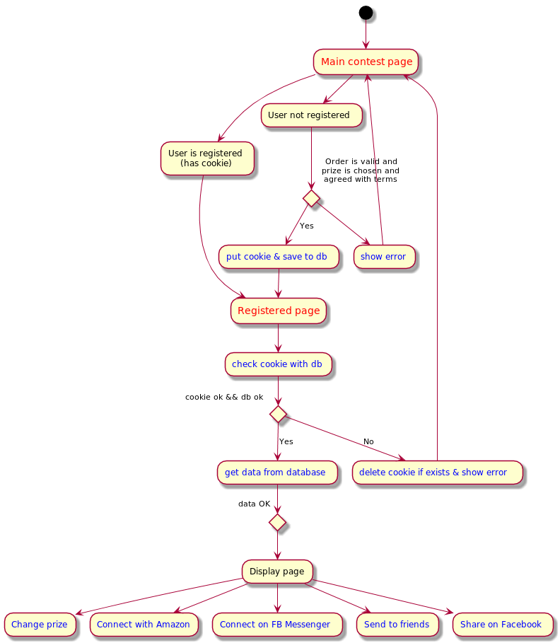
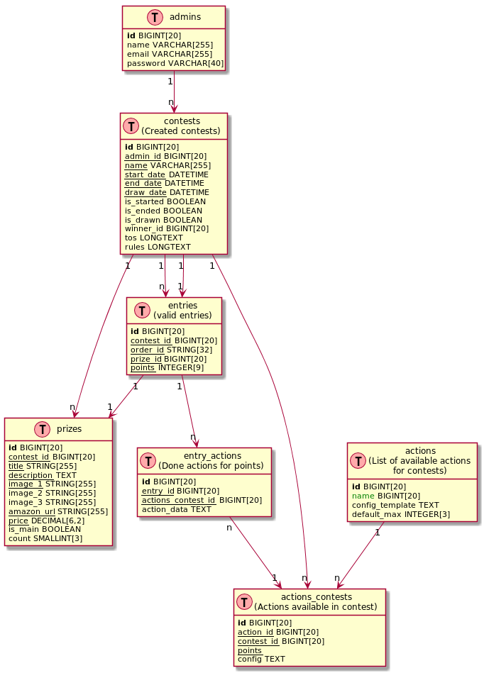

# The contest manager

## Preamble

The contest manager is a tiny web app which will allow customers of a certain brand to register to a contest using their order ID and enter the chance to win one prize.

The prize can be chosen from a list of prizes

The registration with a valid order ID will get the customer n chances

The customer will be able to do extra actions for extra chances

When the contest closes there winner will be drawn using random.org after a specified number of days (to avoid returns)

## Design - This is done

The wireframes are located at:

1. The main contest page (registration and details): https://wireframe.cc/9qEioH
2. The joined page: https://wireframe.cc/9qEioH
3. There will be three more pages containing texts:
    1. Privacy policy
    2. Terms and conditions
    3. Rules

The design should be clean, intuitive, modern and *responsive*

The images can be on white or even transparent background

The design must include success, error and info style messages

The design must be built with a css framework in mind (eg. Bootstrap) to avoid complications when converting to HTML

## Frontend Functionality

1. The main contest page
    1. Will be displayed if no login cookie is present
    2. Login cookie is the actual order ID
    3. If the Order ID is valid (calls an api, always valid for dev puproses) and a prize is chosen then
        1. If the order id is in the database the cookie is set
            1. Redirect to the registered page
        2. If not exists in db we save the order id to the database giving n points for valid order id
            1. Redirect to the registered page
2. The registered page
    1. See current points
    2. See chosen prize
    3. Change prize
    4. Actions for more points
        1. Connect with Amazon
            1. x points
        2. Connect on FB Messenger
            1. y points
        3. Share to Facebook
            1. z points
        4. Send to friends
            1. k points for each request sent
            2. i points for each registered friend
    4. Countdown until contest is over

Pages containing text will be present for

1. Rules
2. Terms and Conditions
3. Privacy policy

### Logic for the frontend functionality

## Backend Functionality

### Database structure

### How it works

1. Admins will be added manually to the database `db:admins`
2. There will be a login page
3. After login an admin will be able to create a contest 
4. Actions `db:actions` will be added manually to the database
5. The creation of the contest will have the following inputs
    1. Contest `db:contests`
        1. Name
        2. Start date
        3. End date
        4. Draw date
        5. Terms and conditions (templates will be provided)
        5. Rules (templates will be provided)
    2. Prizes `db:prizes`
        1. Add one or more main prizes
            1. Entrants will be able to choose from one of the main prizes
        2. Add one or more secondary prizes
        3. Fields for the prizes
            1. Name
            2. Description
            3. Images
            4. Amazon URL
            5. Price
            6. If the prize is main or secondary
            7. Prize count
    3. Actions `db:actions_contests` - The user will choose from default actions
        1. Default actions:
            1. Connect with Amazon
            2. Connect with Facebook
            3. Connect on Messenger
            4. Send to friends
            5. Share on facebook
            6. Tweet this
        2. For almost each action the user will have to input some info (default share message, etc.)
        3. For each chosen action from `db:actions` the admin will have to input the number of points the entrant will get for completing the action
         
